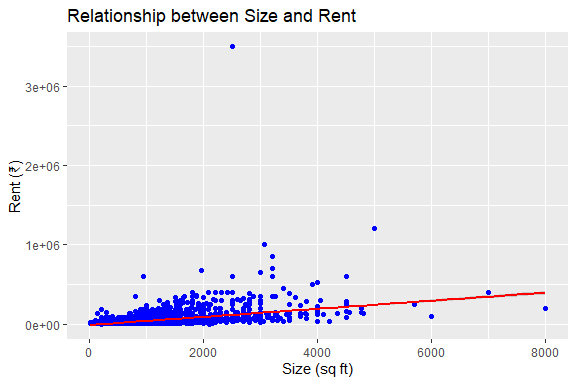

House Rent Prediction
================
Trevor Okinda
2024

- [Student Details](#student-details)
- [Setup Chunk](#setup-chunk)
  - [Source:](#source)
  - [Reference:](#reference)
- [Understanding the Dataset (Exploratory Data Analysis
  (EDA))](#understanding-the-dataset-exploratory-data-analysis-eda)
  - [Loading the Dataset](#loading-the-dataset)
  - [Measures of Frequency](#measures-of-frequency)
  - [Measures of Central Tendency](#measures-of-central-tendency)
  - [Measures of Distribution](#measures-of-distribution)
  - [Measures of Relationship](#measures-of-relationship)
  - [ANOVA](#anova)
  - [Plots](#plots)
- [Preprocessing & Data
  Transformation](#preprocessing--data-transformation)
  - [Missing Values](#missing-values)

# Student Details

|                       |                       |
|-----------------------|-----------------------|
| **Student ID Number** | 134780                |
| **Student Name**      | Trevor Okinda         |
| **BBIT 4.2 Group**    | C                     |
| **Project Name**      | House Rent Prediction |

# Setup Chunk

**Note:** the following KnitR options have been set as the global
defaults: <BR>
`knitr::opts_chunk$set(echo = TRUE, warning = FALSE, eval = TRUE, collapse = FALSE, tidy = TRUE)`.

More KnitR options are documented here
<https://bookdown.org/yihui/rmarkdown-cookbook/chunk-options.html> and
here <https://yihui.org/knitr/options/>.

### Source:

The dataset that was used can be downloaded here: *\<<a
href="https://www.kaggle.com/datasets/iamsouravbanerjee/house-rent-prediction-dataset?select=House_Rent_Dataset.csv\"
class="uri">https://www.kaggle.com/datasets/iamsouravbanerjee/house-rent-prediction-dataset?select=House_Rent_Dataset.csv\</a>\>*

### Reference:

*\<Banerjee, S. (n.d.). House Rent Prediction Dataset \[Data set\].
Kaggle. <a
href="https://www.kaggle.com/datasets/iamsouravbanerjee/house-rent-prediction-dataset?select=House_Rent_Dataset.csv\"
class="uri">https://www.kaggle.com/datasets/iamsouravbanerjee/house-rent-prediction-dataset?select=House_Rent_Dataset.csv\</a>\>  
Refer to the APA 7th edition manual for rules on how to cite datasets:
<https://apastyle.apa.org/style-grammar-guidelines/references/examples/data-set-references>*

# Understanding the Dataset (Exploratory Data Analysis (EDA))

## Loading the Dataset

``` r
# Load the dataset
HouseRentData <- read.csv("House_Rent_Dataset.csv", colClasses = c(
  BHK = "numeric",                     # Number of bedrooms
  Rent = "numeric",                    # Rent amount
  Size = "numeric",                    # Size in square feet
  Area_Type = "factor",                # Type of area (e.g., Super Area)
  Area_Locality = "factor",         # Locality name
  City = "factor",                     # City name
  Furnishing_Status = "factor",        # Furnishing status (e.g., Furnished)
  Tenant_Preferred = "factor",         # Tenant preference
  Bathroom = "numeric",                # Number of bathrooms
  Point_of_Contact = "factor"       # Point of contact information
))

# Display structure to verify data types
str(HouseRentData)
```

    ## 'data.frame':    4746 obs. of  10 variables:
    ##  $ BHK              : num  2 2 2 2 2 2 2 1 2 2 ...
    ##  $ Rent             : num  10000 20000 17000 10000 7500 7000 10000 5000 26000 10000 ...
    ##  $ Size             : num  1100 800 1000 800 850 600 700 250 800 1000 ...
    ##  $ Area_Type        : Factor w/ 3 levels "Built Area","Carpet Area",..: 3 3 3 3 2 3 3 3 2 2 ...
    ##  $ Area_Locality    : Factor w/ 2235 levels " Beeramguda, Ramachandra Puram, NH 9",..: 219 1573 1810 537 1949 2039 1221 1221 1521 1399 ...
    ##  $ City             : Factor w/ 6 levels "Bangalore","Chennai",..: 5 5 5 5 5 5 5 5 5 5 ...
    ##  $ Furnishing_Status: Factor w/ 3 levels "Furnished","Semi-Furnished",..: 3 2 2 3 3 3 3 3 3 2 ...
    ##  $ Tenant_Preferred : Factor w/ 3 levels "Bachelors","Bachelors/Family",..: 2 2 2 2 1 2 1 1 1 2 ...
    ##  $ Bathroom         : num  2 1 1 1 1 2 2 1 2 2 ...
    ##  $ Point_of_Contact : Factor w/ 3 levels "Contact Agent",..: 3 3 3 3 3 3 1 1 1 3 ...

``` r
# Display first few rows to ensure data is loaded correctly
head(HouseRentData)
```

    ##   BHK  Rent Size   Area_Type            Area_Locality    City Furnishing_Status
    ## 1   2 10000 1100  Super Area                   Bandel Kolkata       Unfurnished
    ## 2   2 20000  800  Super Area Phool Bagan, Kankurgachi Kolkata    Semi-Furnished
    ## 3   2 17000 1000  Super Area  Salt Lake City Sector 2 Kolkata    Semi-Furnished
    ## 4   2 10000  800  Super Area              Dumdum Park Kolkata       Unfurnished
    ## 5   2  7500  850 Carpet Area            South Dum Dum Kolkata       Unfurnished
    ## 6   2  7000  600  Super Area              Thakurpukur Kolkata       Unfurnished
    ##   Tenant_Preferred Bathroom Point_of_Contact
    ## 1 Bachelors/Family        2    Contact Owner
    ## 2 Bachelors/Family        1    Contact Owner
    ## 3 Bachelors/Family        1    Contact Owner
    ## 4 Bachelors/Family        1    Contact Owner
    ## 5        Bachelors        1    Contact Owner
    ## 6 Bachelors/Family        2    Contact Owner

``` r
# Optional: View the dataset in spreadsheet-like interface
View(HouseRentData)
```

## Measures of Frequency

``` r
# Load necessary libraries
library(dplyr)  # For data manipulation
```

    ## 
    ## Attaching package: 'dplyr'

    ## The following objects are masked from 'package:stats':
    ## 
    ##     filter, lag

    ## The following objects are masked from 'package:base':
    ## 
    ##     intersect, setdiff, setequal, union

``` r
library(ggplot2)  # For visualizations
library(corrplot)  # For correlation plots
```

    ## corrplot 0.95 loaded

``` r
# Assuming `HouseRentData` is already loaded

# Measures of Frequency
# Frequency distribution for categorical variables
frequency_analysis <- function(data, column_name) {
  return(data %>%
           group_by(!!sym(column_name)) %>%
           summarize(Frequency = n()) %>%
           arrange(desc(Frequency)))
}

# Example: Frequency of cities
city_frequency <- frequency_analysis(HouseRentData, "City")
print(city_frequency)
```

    ## # A tibble: 6 × 2
    ##   City      Frequency
    ##   <fct>         <int>
    ## 1 Mumbai          972
    ## 2 Chennai         891
    ## 3 Bangalore       886
    ## 4 Hyderabad       868
    ## 5 Delhi           605
    ## 6 Kolkata         524

## Measures of Central Tendency

``` r
# Measures of Central Tendency
# Mean, Median, Mode
mean_rent <- mean(HouseRentData$Rent, na.rm = TRUE)
median_rent <- median(HouseRentData$Rent, na.rm = TRUE)
mode_rent <- as.numeric(names(sort(table(HouseRentData$Rent), decreasing = TRUE)[1]))

cat("Mean Rent:", mean_rent, "\n")
```

    ## Mean Rent: 34993.45

``` r
cat("Median Rent:", median_rent, "\n")
```

    ## Median Rent: 16000

``` r
cat("Mode Rent:", mode_rent, "\n")
```

    ## Mode Rent: 15000

## Measures of Distribution

``` r
# Measures of Distribution
# Range, Variance, Standard Deviation, Interquartile Range
range_rent <- range(HouseRentData$Rent, na.rm = TRUE)
variance_rent <- var(HouseRentData$Rent, na.rm = TRUE)
sd_rent <- sd(HouseRentData$Rent, na.rm = TRUE)
iqr_rent <- IQR(HouseRentData$Rent, na.rm = TRUE)

cat("Range of Rent:", range_rent, "\n")
```

    ## Range of Rent: 1200 3500000

``` r
cat("Variance of Rent:", variance_rent, "\n")
```

    ## Variance of Rent: 6100611742

``` r
cat("Standard Deviation of Rent:", sd_rent, "\n")
```

    ## Standard Deviation of Rent: 78106.41

``` r
cat("Interquartile Range of Rent:", iqr_rent, "\n")
```

    ## Interquartile Range of Rent: 23000

## Measures of Relationship

``` r
# Measures of Relationship
# Correlation Matrix
# Selecting numeric variables for correlation
numeric_columns <- HouseRentData %>%
  select_if(is.numeric)

correlation_matrix <- cor(numeric_columns, use = "complete.obs")
print(correlation_matrix)
```

    ##                BHK      Rent      Size  Bathroom
    ## BHK      1.0000000 0.3697176 0.7161450 0.7948854
    ## Rent     0.3697176 1.0000000 0.4135508 0.4412152
    ## Size     0.7161450 0.4135508 1.0000000 0.7407030
    ## Bathroom 0.7948854 0.4412152 0.7407030 1.0000000

``` r
# Correlation heatmap
corrplot(correlation_matrix, method = "circle", type = "upper", tl.col = "black")
```

<!-- -->

``` r
# Example: Scatter plot to visualize relationship
ggplot(HouseRentData, aes(x = Size, y = Rent)) +
  geom_point(color = "blue") +
  geom_smooth(method = "lm", col = "red") +
  labs(title = "Relationship between Size and Rent",
       x = "Size (sq ft)",
       y = "Rent (₹)")
```

    ## `geom_smooth()` using formula = 'y ~ x'

<!-- -->

## ANOVA

``` r
# Check structure of the dataset
str(HouseRentData)
```

    ## 'data.frame':    4746 obs. of  10 variables:
    ##  $ BHK              : num  2 2 2 2 2 2 2 1 2 2 ...
    ##  $ Rent             : num  10000 20000 17000 10000 7500 7000 10000 5000 26000 10000 ...
    ##  $ Size             : num  1100 800 1000 800 850 600 700 250 800 1000 ...
    ##  $ Area_Type        : Factor w/ 3 levels "Built Area","Carpet Area",..: 3 3 3 3 2 3 3 3 2 2 ...
    ##  $ Area_Locality    : Factor w/ 2235 levels " Beeramguda, Ramachandra Puram, NH 9",..: 219 1573 1810 537 1949 2039 1221 1221 1521 1399 ...
    ##  $ City             : Factor w/ 6 levels "Bangalore","Chennai",..: 5 5 5 5 5 5 5 5 5 5 ...
    ##  $ Furnishing_Status: Factor w/ 3 levels "Furnished","Semi-Furnished",..: 3 2 2 3 3 3 3 3 3 2 ...
    ##  $ Tenant_Preferred : Factor w/ 3 levels "Bachelors","Bachelors/Family",..: 2 2 2 2 1 2 1 1 1 2 ...
    ##  $ Bathroom         : num  2 1 1 1 1 2 2 1 2 2 ...
    ##  $ Point_of_Contact : Factor w/ 3 levels "Contact Agent",..: 3 3 3 3 3 3 1 1 1 3 ...

``` r
# Perform one-way ANOVA
anova_result <- aov(Rent ~ Furnishing_Status, data = HouseRentData)

# Display ANOVA summary
summary(anova_result)
```

    ##                     Df    Sum Sq   Mean Sq F value Pr(>F)    
    ## Furnishing_Status    2 6.195e+11 3.098e+11   51.86 <2e-16 ***
    ## Residuals         4743 2.833e+13 5.973e+09                   
    ## ---
    ## Signif. codes:  0 '***' 0.001 '**' 0.01 '*' 0.05 '.' 0.1 ' ' 1

``` r
# Post-hoc test (if ANOVA is significant, use Tukey's HSD to determine pairwise differences)
tukey_result <- TukeyHSD(anova_result)
print(tukey_result)
```

    ##   Tukey multiple comparisons of means
    ##     95% family-wise confidence level
    ## 
    ## Fit: aov(formula = Rent ~ Furnishing_Status, data = HouseRentData)
    ## 
    ## $Furnishing_Status
    ##                                 diff       lwr        upr p adj
    ## Semi-Furnished-Furnished   -17391.50 -25319.89  -9463.103 9e-07
    ## Unfurnished-Furnished      -33648.67 -41795.00 -25502.342 0e+00
    ## Unfurnished-Semi-Furnished -16257.17 -21972.98 -10541.375 0e+00

## Plots

``` r
# Visualize group means
ggplot(HouseRentData, aes(x = Furnishing_Status, y = Rent, fill = Furnishing_Status)) +
  geom_boxplot() +
  labs(title = "Boxplot of Rent by Furnishing Status",
       x = "Furnishing Status",
       y = "Rent") +
  theme_minimal()
```

<!-- -->

``` r
# Load necessary libraries
library(ggplot2)
library(corrplot)
library(dplyr)

# Univariate Plots

# Histogram for numeric variable (e.g., Rent)
ggplot(HouseRentData, aes(x = Rent)) +
  geom_histogram(binwidth = 5000, fill = "blue", color = "black") +
  labs(title = "Histogram of Rent", x = "Rent (₹)", y = "Frequency") +
  theme_minimal()
```

<!-- -->

``` r
# Boxplot for numeric variable (e.g., Size)
ggplot(HouseRentData, aes(y = Size)) +
  geom_boxplot(fill = "orange", color = "black") +
  labs(title = "Boxplot of House Size", y = "Size (sq ft)") +
  theme_minimal()
```

<!-- -->

``` r
# Bar plot for categorical variable (e.g., Furnishing_Status)
ggplot(HouseRentData, aes(x = Furnishing_Status)) +
  geom_bar(fill = "purple", color = "black") +
  labs(title = "Bar Plot of Furnishing Status", x = "Furnishing Status", y = "Count") +
  theme_minimal()
```

<!-- -->

``` r
# Multivariate Plots

# Scatter plot for two numeric variables (e.g., Size vs. Rent)
ggplot(HouseRentData, aes(x = Size, y = Rent)) +
  geom_point(color = "blue", alpha = 0.6) +
  geom_smooth(method = "lm", color = "red", se = FALSE) +
  labs(title = "Scatter Plot of Size vs Rent", x = "Size (sq ft)", y = "Rent (₹)") +
  theme_minimal()
```

    ## `geom_smooth()` using formula = 'y ~ x'

<!-- -->

``` r
# Boxplot for numeric variable grouped by categorical variable (e.g., Rent by Furnishing_Status)
ggplot(HouseRentData, aes(x = Furnishing_Status, y = Rent, fill = Furnishing_Status)) +
  geom_boxplot() +
  labs(title = "Boxplot of Rent by Furnishing Status", x = "Furnishing Status", y = "Rent (₹)") +
  theme_minimal()
```

<!-- -->

``` r
# Faceted plots to compare distributions (e.g., Rent distribution by City)
ggplot(HouseRentData, aes(x = Rent)) +
  geom_histogram(binwidth = 5000, fill = "green", color = "black") +
  facet_wrap(~City) +
  labs(title = "Histogram of Rent by City", x = "Rent (₹)", y = "Frequency") +
  theme_minimal()
```

<!-- -->

``` r
# Heatmap of correlation matrix (numeric variables)
numeric_columns <- HouseRentData %>%
  select_if(is.numeric)
correlation_matrix <- cor(numeric_columns, use = "complete.obs")
corrplot(correlation_matrix, method = "color", type = "upper", tl.col = "black")
```

<!-- -->

# Preprocessing & Data Transformation

## Missing Values

``` r
# Check for missing values in the dataset

# Summarize missing values for each column
missing_summary <- colSums(is.na(HouseRentData))

# Display the summary of missing values
print(missing_summary)
```

    ##               BHK              Rent              Size         Area_Type 
    ##                 0                 0                 0                 0 
    ##     Area_Locality              City Furnishing_Status  Tenant_Preferred 
    ##                 0                 0                 0                 0 
    ##          Bathroom  Point_of_Contact 
    ##                 0                 0

``` r
# Check if there are any missing values in the entire dataset
any_missing <- any(is.na(HouseRentData))
cat("Are there any missing values in the dataset? ", any_missing, "\n")
```

    ## Are there any missing values in the dataset?  FALSE

``` r
# Visualize missing values (optional, requires the 'naniar' library)
library(naniar)

# Plot missing values
gg_miss_var(HouseRentData) +
  labs(title = "Missing Values by Variable",
       x = "Variables", y = "Number of Missing Values") +
  theme_minimal()
```

<!-- -->
